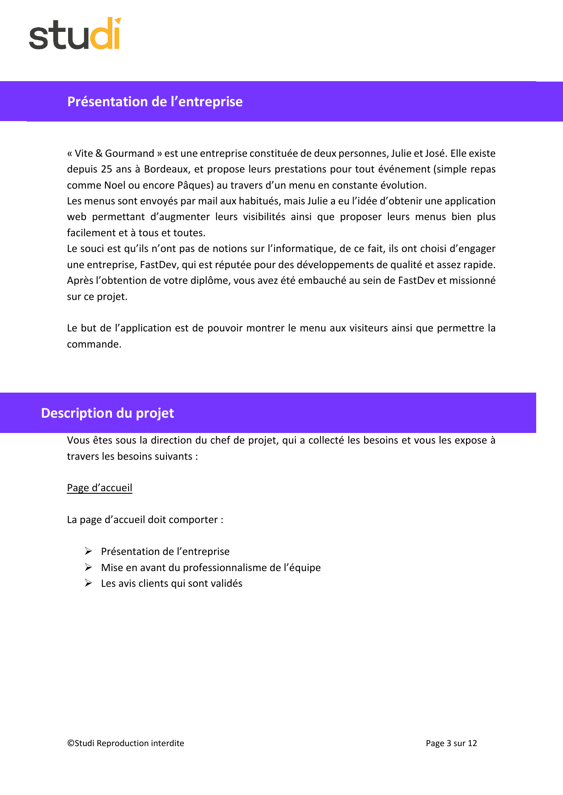
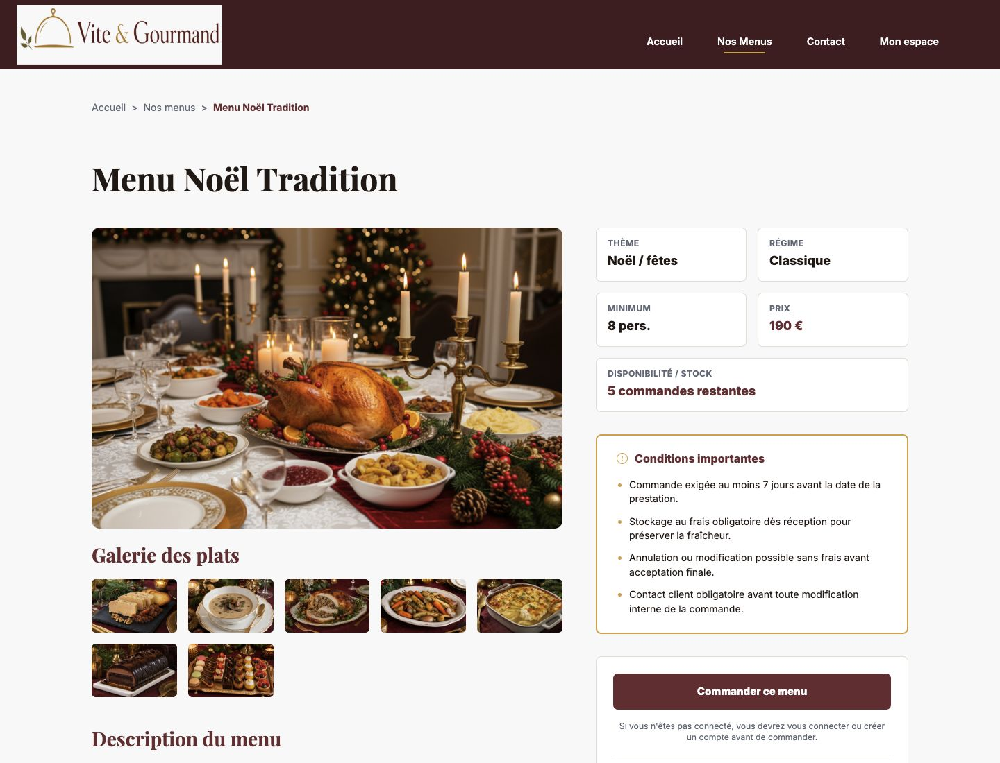
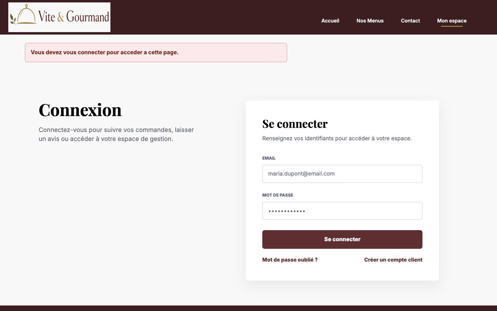

# Audit page 03 - Demandes UX/UI de l'entreprise

Date : 2026-07-21
Perimetre : page 3 de l'enonce, premiere page de demandes UX/UI et parcours public.

## Source auditee

La page 3 de l'enonce demande :

- augmenter la visibilite de Vite & Gourmand ;
- proposer les menus plus facilement et a tous ;
- montrer le menu aux visiteurs ;
- permettre la commande ;
- sur la page d'accueil : presenter l'entreprise ;
- sur la page d'accueil : mettre en avant le professionnalisme de l'equipe ;
- sur la page d'accueil : afficher les avis clients qui sont valides.

Preuve source :



## Tests et preuves produits

### 1. Lecture PDF

- PDF rendu en image avec `pdftoppm` : `docs/project-management/audit-page-03-assets/source-enonce-page-03.png`.
- Texte extrait avec le runtime Python/PDF disponible : `docs/project-management/audit-page-03-assets/source-enonce-page-03.txt`.
- Resultat : la page 3 contient bien les demandes listees ci-dessus.

### 2. Controle Figma

- Fichier Figma : `sMkvVuvOyBkMvlTIsq2eCY`.
- Node inspecte : `66:5`, frame `Home - Desktop`.
- La metadata Figma montre les sections suivantes : `hero`, `section-qui-sommes-nous`, `nos-engagements-section`, `section-menus-accueil`, `section-avis-clients`, `footer`.
- Capture Figma sauvegardee : `docs/project-management/audit-page-03-assets/00-figma-home-desktop-node-66-5.png`.

Conclusion Figma : la maquette d'accueil couvre bien les demandes de la page 3.

### 3. Tests HTTP locaux

Serveur lance :

```bash
php -S 127.0.0.1:8026 -t public
```

Routes testees :

| Route | Resultat | Interpretation |
| --- | --- | --- |
| `/` | 200 | Accueil public accessible. |
| `/menus` | 200 | Liste des menus accessible sans connexion. |
| `/menus/1` | 200 | Detail menu accessible sans connexion. |
| `/commandes/creation/1` | 302 vers `/connexion` | La commande existe, mais impose la connexion. |

### 4. Tests DOM et interactions

Test desktop `1440x1100` sur `/` :

- sections rendues : hero, presentation, engagements, menus, avis ;
- 6 menus visibles au depart ;
- 3 avis affiches ;
- filtre rapide `Disponible` teste : passage de 6 menus visibles a 3 menus visibles ;
- aucune erreur console remontee pendant le test.

Test mobile `390x844` sur `/` :

- sections rendues : hero, presentation, engagements, menus, avis ;
- 6 menus visibles au depart ;
- filtre rapide `Disponible` teste : passage de 6 menus visibles a 3 menus visibles ;
- aucune erreur console remontee pendant le test.

Test commande :

- sur `/menus/1`, un seul lien `Commander ce menu` est present ;
- href du lien : `/commandes/creation/1` ;
- acces a `/commandes/creation/1` sans connexion : redirection vers `/connexion` ;
- la page de connexion affiche le message "Vous devez vous connecter pour acceder a cette page."

Captures acceptees :






Limite de preuve visuelle : l'outil de capture navigateur a produit des captures scrollees non fiables pour les sections basses de l'accueil. Les sections basses ont donc ete verifiees par DOM runtime, HTML rendu, Figma et code, mais les captures scrollees de l'accueil ne sont pas retenues comme preuve visuelle.

## Verification des demandes

| Demande page 3 | Verdict | Justification |
| --- | --- | --- |
| Augmenter la visibilite de Vite & Gourmand | Realisee cote interface locale | L'accueil public est accessible en 200, marque clairement le nom Vite & Gourmand, propose une navigation publique et un CTA vers les menus. Non teste ici : visibilite reelle en production, SEO, nom de domaine. |
| Proposer les menus plus facilement et a tous | Realisee | `/menus` est public, l'accueil affiche une selection de 6 menus, le filtre `Disponible` fonctionne sans erreur et reduit la liste a 3 menus. |
| Montrer le menu aux visiteurs | Realisee | `/menus` et `/menus/1` retournent 200 sans connexion. Le detail menu affiche images, prix, minimum de personnes, disponibilite, conditions et CTA. |
| Permettre la commande | Realisee comme point d'entree, a re-auditer page commande | Le detail menu contient `Commander ce menu`, qui pointe vers `/commandes/creation/1`. Sans connexion, la route redirige vers `/connexion`, ce qui confirme un parcours commande protege. Le formulaire complet de commande dependra de la page 7 de l'enonce. |
| Page d'accueil : presentation de l'entreprise | Realisee | `home/index.php` contient `Qui sommes-nous ?`, `Notre Histoire`, Bordeaux, 25 ans, Julie et Jose. Les tests DOM desktop/mobile retrouvent la section. |
| Page d'accueil : professionnalisme de l'equipe | Realisee | Le hero mentionne le professionnalisme, la section equipe explique les roles de Julie/Jose, et `NOS ENGAGEMENTS` presente expertise, fraicheur, cuisine inclusive, ponctualite. |
| Page d'accueil : avis clients valides | Realisee apres correction | L'accueil charge maintenant `ReviewModel::findValidated(3)` via `HomeController`, puis `home/index.php` rend les avis transmis par la base. La requete filtre `WHERE a.statut = 'valide'`, donc les avis `en_attente` ou `refuse` ne sont pas publies. Preuve detaillee : `docs/project-management/preuve-avis-valides-accueil-2026-07-21.md`. |

## Preuves code principales

- `config/routes.php:31-35` : routes publiques `/`, `/menus`, `/menus/{id}`.
- `config/routes.php:49-52` : routes commande protegees par authentification.
- `app/Views/home/index.php:194-207` : hero + CTA vers les menus.
- `app/Views/home/index.php:211-260` : presentation entreprise et equipe.
- `app/Views/home/index.php:262-282` : engagements/professionnalisme.
- `app/Views/home/index.php:284-378` : selection de menus et filtres.
- `app/Views/home/index.php:408-463` : section avis affichee depuis les avis valides transmis par le controleur.
- `app/Views/home/index.php:169-220` : preparation du rendu des avis dynamiques, avec fallback si aucun avis valide n'existe.
- `app/Controllers/HomeController.php:22-30` : l'accueil charge `ReviewModel::findValidated(3)`.
- `app/Models/ReviewModel.php:17-42` : methode disponible pour charger seulement les avis `valide`.
- `app/Views/menus/show.php:154-158` : CTA `Commander ce menu`.
- `public/assets/js/app.js:494-512` : application des filtres menus.

## Ecarts et risques

1. Avis tres bas sur mobile
   Impact : en `390x844`, les avis commencent vers `y=7851`, apres une section menus tres longue. Ils existent, mais sont peu visibles pour un visiteur mobile.
   Priorite : moyenne UX.

2. Capture scrollee navigateur non fiable pendant l'audit
   Impact : limite de preuve visuelle pour les sections basses dans ce rapport. Les preuves DOM/code/Figma compensent pour la verification fonctionnelle, mais une recette finale devrait conserver des captures propres.
   Priorite : faible pour le produit, moyenne pour le dossier de preuve.

## Correctif applique apres audit

- Accueil branche sur `ReviewModel::findValidated(3)` via `HomeController`.
- Vue `home/index.php` adaptee pour consommer `validatedReviews` au lieu d'un tableau statique.
- Seed SQL enrichi : les trois avis decoratifs sont devenus de vrais avis relies a des clients, commandes terminees, menus et moderateurs.
- Preuve dediee ajoutee : `docs/project-management/preuve-avis-valides-accueil-2026-07-21.md`.
- Tests : `composer check`, test modele sur base temporaire issue du seed, test HTTP `GET /` sur base temporaire, test HTTP `GET /` sur base locale actuelle.

## Verdict global page 3

La page 3 est couverte pour les demandes auditees ici.

Demandes UX/UI realisees : presentation entreprise, professionnalisme, menus publics, detail menu, entree de parcours commande, avis clients valides et responsive de base.
Point de vigilance restant : les avis existent sur mobile, mais restent tres bas dans la page a cause de la longueur de la section menus.
