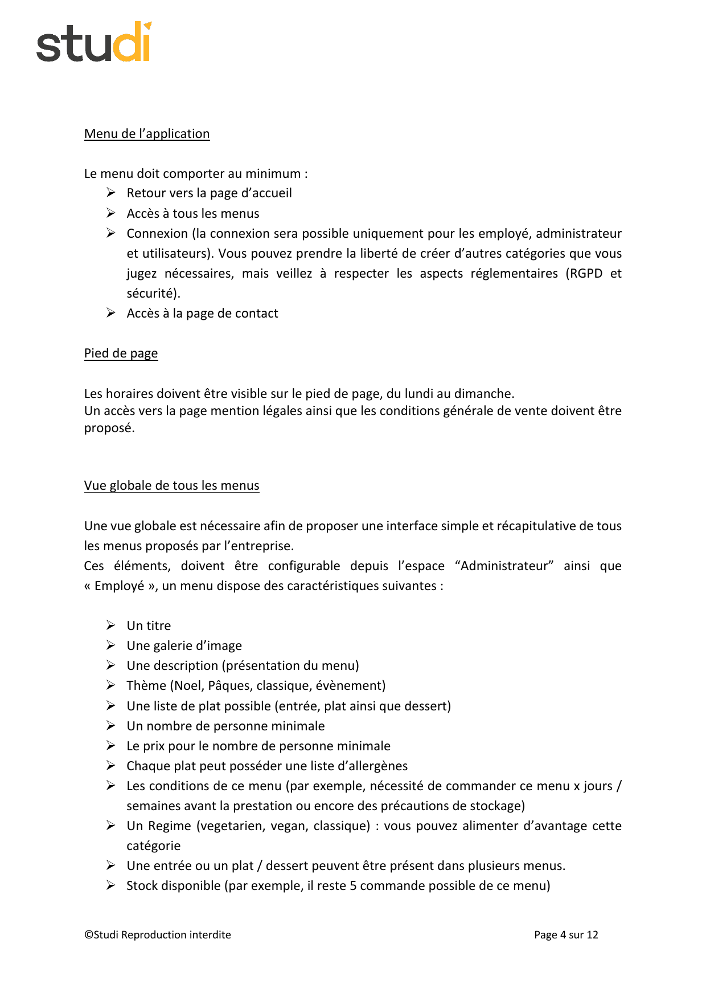
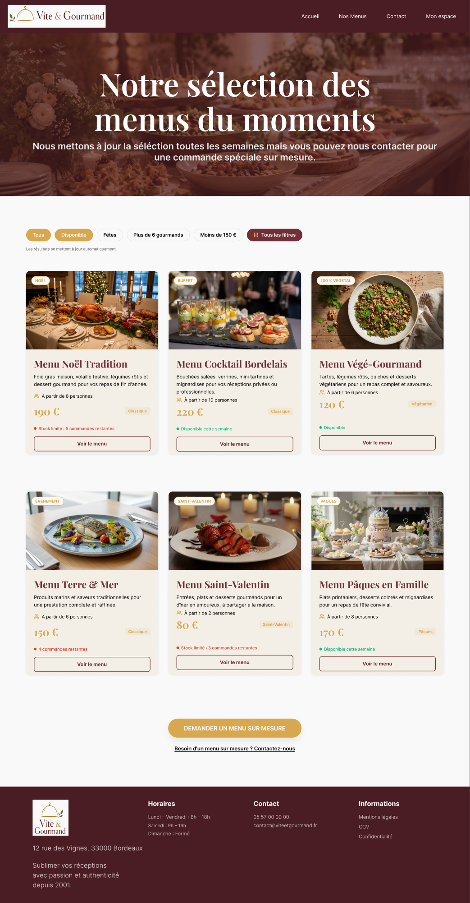
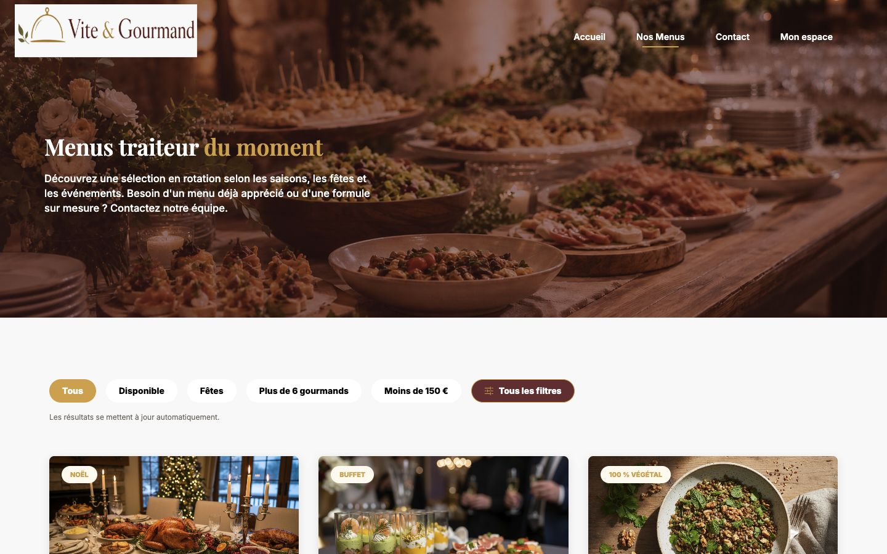
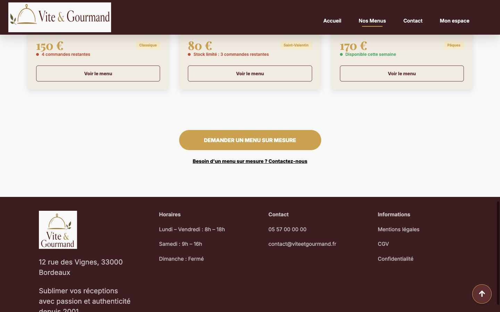
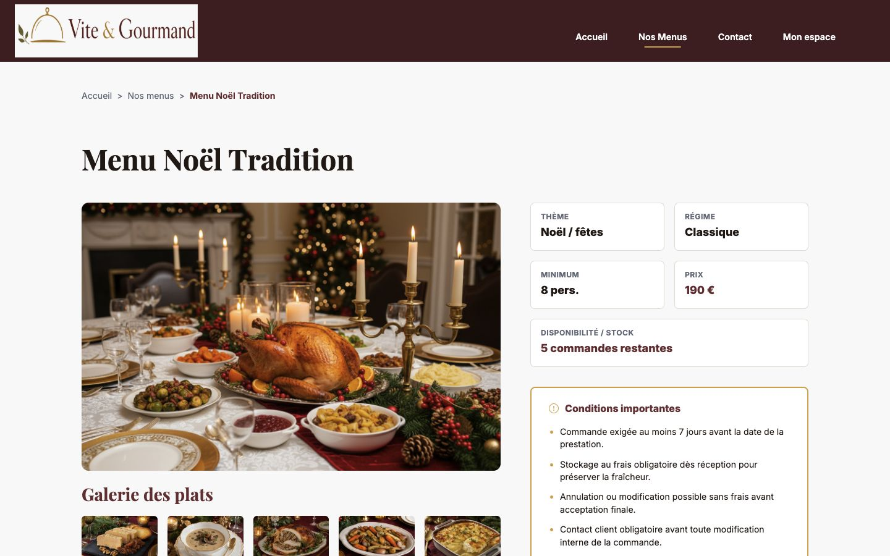
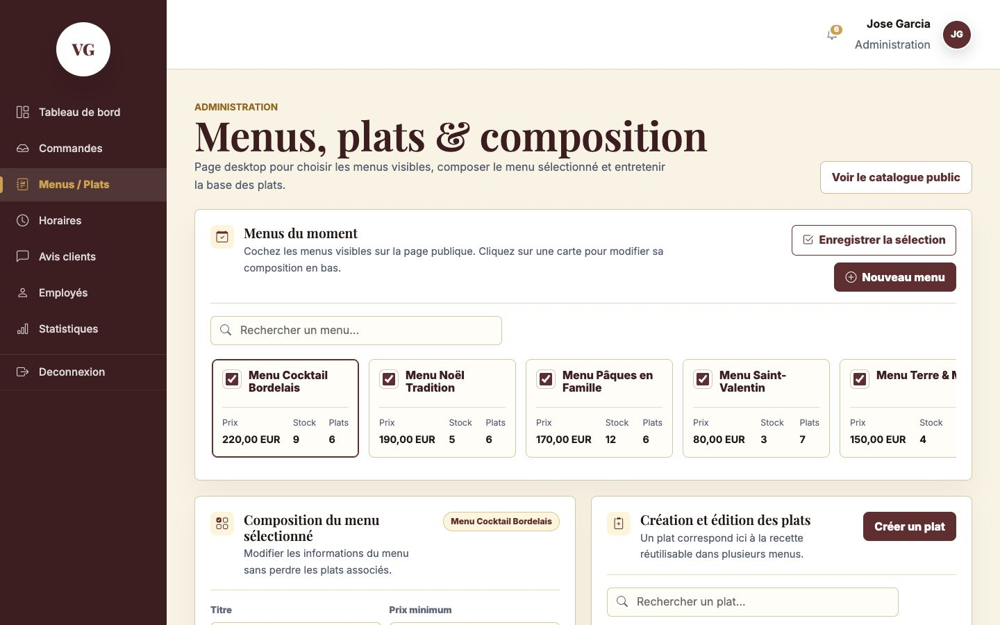
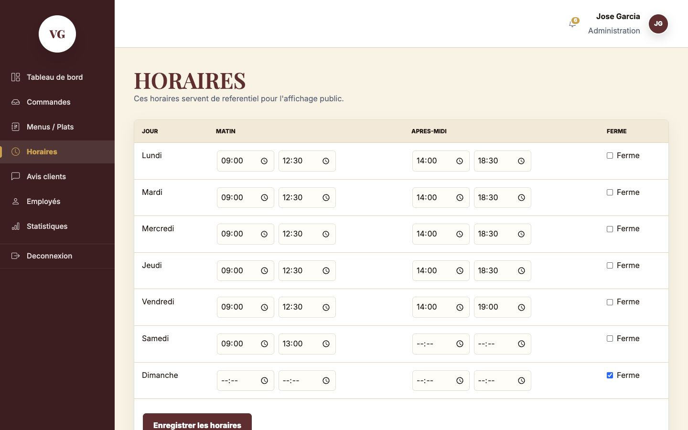
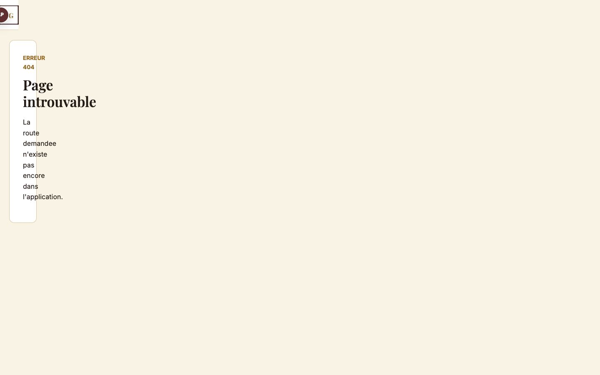

# Audit page 4 - Menu applicatif, footer et catalogue menus

Date de l'audit : 2026-07-21.
Reaudit local : 2026-07-21, depot local. Branche observee au debut : `feature/back-office` ; branche courante au rendu : `docs/finalisation-dossier-jury`.
Mise a jour correctif : 2026-07-22, footer horaires rendu dynamique, galerie admin ajoutee et decision de perimetre employe documentee.
Perimetre : page 4 de l'enonce ECF, application locale, documentation locale, Notion, Figma, et etat Git/GitHub.
Source de verite : depot local, car toutes les modifications ne sont pas encore poussees.
Verdict global : **majoritairement conforme**. Le parcours public est bien avance, le footer horaires est branche sur la table `horaires`, et la galerie des menus est maintenant administrable. Le principal point a arbitrer avant main reste l'absence volontaire de gestion menus/plats/horaires cote employe, documentee mais differente de la lecture litterale de l'enonce.

## Decision push / main

| Cible | Decision | Justification |
|---|---:|---|
| Push sur branche de travail courante | Possible pour sauvegarder l'audit, le correctif footer et les preuves | `composer check` passe ; le footer public reagit aux changements de la table `horaires`. |
| Merge vers `develop` | Possible apres revue | Les correctifs footer et galerie sont operationnels ; il reste a valider l'arbitrage employe. |
| Merge vers `main` | **A arbitrer** | `main` doit rester stable et defendable devant le jury ; l'ecart employe/enonce doit etre assume ou corrige. |

## Sources auditees

- Enonce page 4 : `docs/project-management/audit-page-04-assets/source-enonce-page-04.txt`, `tmp/pdfs/enonce-page-04.txt` et capture source ci-dessous.
- Regle permanente d'audit : `docs/project-management/audit-context.md`.
- Decision de perimetre employe : `docs/project-management/decision-role-employe-menus-2026-07-22.md`.
- Application locale testee : `http://127.0.0.1:8034` pendant le reaudit initial, `http://127.0.0.1:8042` pendant le correctif horaires, puis `http://127.0.0.1:8000` pendant le correctif galerie.
- Code : `config/routes.php`, `app/Views/layouts/main.php`, `app/Controllers/MenuController.php`, `app/Controllers/AdminController.php`, `app/Models/MenuModel.php`, `app/Models/DishModel.php`, `app/Models/ScheduleModel.php`, `app/Views/menus/index.php`, `app/Views/menus/show.php`, `app/Views/admin/menus.php`, `app/Views/admin/schedules.php`.
- Base SQL : `database/sql/create_database.sql`, `database/sql/seed_database.sql`.
- Figma : fichier `sMkvVuvOyBkMvlTIsq2eCY`, node `460:19068` "Liste menus - Index - Desktop".
- Notion : pages "Cahier des charges*" et "Gestion de projet".
- Git/GitHub : remote `https://github.com/elscribe/Github-vite-et-gourmand.git`, branche observee au debut `feature/back-office`, branche courante au rendu `docs/finalisation-dossier-jury`.



## Demandes obligatoires page 4

La page 4 demande :

- un menu applicatif avec retour accueil, acces a tous les menus, connexion et contact ;
- un footer avec horaires visibles du lundi au dimanche ;
- un acces aux mentions legales et aux CGV ;
- une vue globale simple de tous les menus ;
- des menus configurables depuis les espaces Administrateur et Employe ;
- pour chaque menu : titre, galerie d'image, description, theme, plats possibles entree/plat/dessert, nombre minimum de personnes, prix minimum, allergenes par plat, conditions, regime, plats reutilisables dans plusieurs menus, stock disponible.

## Captures acceptees

### Figma - catalogue attendu



Le frame Figma confirme une structure publique avec header, hero, filtres rapides, 6 cartes menus, CTA contact et footer.

### Application - catalogue public



Preuve visuelle : header public avec Accueil, Nos Menus, Contact, Mon espace ; hero catalogue ; filtres rapides.

### Application - footer



Preuve visuelle : footer present avec horaires, contact, mentions legales, CGV et confidentialite. Correctif 2026-07-22 : les horaires sont maintenant rendus du lundi au dimanche depuis la table `horaires`.

### Application - detail d'un menu



Preuve visuelle : fiche detail avec galerie, description, theme, regime, minimum, prix, stock, conditions et composition entree/plat/dessert.

### Application - back-office admin menus/plats



Preuve visuelle : l'administrateur peut selectionner les menus publics, modifier les champs principaux, gerer la composition et les plats/allergenes.

### Application - back-office admin horaires



Preuve visuelle : les horaires sont gerables du lundi au dimanche en back-office admin.

### Application - employe bloque sur la gestion admin


Preuve visuelle : un compte employe connecte recoit un acces refuse sur `/admin/menus`.

### Application - route employe menus absente



Preuve visuelle : la route `/employe/menus` n'existe pas.

## Resultats par exigence

| Exigence page 4 | Statut | Preuves | Reserve |
|---|---:|---|---|
| Retour vers l'accueil | Conforme | Route `/` en 200 ; logo et lien Accueil dans `app/Views/layouts/main.php:265` et `:280`. | Aucune reserve bloquante. |
| Acces a tous les menus | Conforme | Route `/menus` en 200 ; lien "Nos Menus" dans `app/Views/layouts/main.php:281` ; 6 cartes visibles. | Les images principales viennent maintenant de `menu_images`; certains textes marketing restent enrichis par `MenuPresentation`. |
| Connexion | Conforme | Route `/connexion` en 200 ; formulaire `auth/login.php:8-43` ; connexions admin/employe testees avec succes. | Le libelle desktop public est "Mon espace" plutot que "Connexion", mais il mene bien a `/connexion`. |
| Acces contact | Conforme | Route `/contact` en 200 ; lien `app/Views/layouts/main.php:282`. | Aucune reserve bloquante. |
| Footer avec horaires | Conforme | Footer visible `app/Views/layouts/main.php:385-391`; horaires injectes par `app/Core/BaseController.php:68-98` depuis `ScheduleModel`; test dynamique OK. | Fallback statique prevu uniquement si la base horaires est indisponible. |
| Mentions legales et CGV | Conforme partiel | Routes `/mentions-legales` et `/cgv` en 200 ; liens footer `app/Views/layouts/main.php:400-401`. | Les mentions legales contiennent encore "Hebergement : information a completer". |
| Vue globale de tous les menus | Conforme | `MenuController::index()` charge `findActiveMenus()` ; Figma et app affichent 6 menus. | "Tous" signifie tous les menus actifs publics, pas tous les menus de base non actifs. C'est coherent cote visiteur. |
| Titre, description, theme, regime, minimum, prix, stock | Conforme | SQL `menus` couvre ces champs ; public detail les affiche ; admin permet de les modifier. | Public presentation parfois issue de `MenuPresentation`. |
| Galerie d'images | Conforme | Table SQL `menu_images`; la position 1 pilote l'image principale accueil/catalogue/detail ; les positions suivantes alimentent la galerie des plats ; `/admin/menus` permet ajout/remplacement par fichier local, modification de position, texte alternatif et suppression. | Upload limite aux images PNG/JPG/WebP ; pas de bibliotheque media dediee, suffisant pour le MVP ECF. |
| Plats entree/plat/dessert | Conforme | Tables `plats` et `menu_plats`; admin composition groupe entree/plat/dessert. | Aucun probleme bloquant observe. |
| Allergene par plat | Conforme | Tables `allergenes` et `plat_allergenes`; admin creation/edition plats inclut allergenes ; detail les affiche. | A confirmer par test de modification reelle si on veut une recette exhaustive. |
| Conditions du menu | Conforme | Champ SQL `conditions`; admin textarea conditions ; detail affiche un bloc conditions visible. | Une partie des conditions detaillees vient de `MenuPresentation`. |
| Plats reutilisables dans plusieurs menus | Conforme | Table `menu_plats` avec cle composee `(id_menu, id_plat)` ; un plat peut etre lie a plusieurs menus. | Aucun probleme bloquant observe. |
| Configurable depuis Administrateur | Conforme | `/admin/menus` et `/admin/horaires` en 200 apres login admin ; menus, plats, composition, horaires et galerie images administrables. | Les images sont gerees par fichier local pour rester lisible par un administrateur non technique. |
| Configurable depuis Employe | Ecart assume/documente | Login employe OK ; `/admin/menus` retourne 403 ; `/employe/menus` retourne 404 ; decision documentee le 2026-07-22. | Ecart avec l'enonce et le cahier des charges Notion si une conformite litterale est exigee. |

## Tests executes

### Qualite code et environnement

Tests locaux executes pendant le reaudit :

```text
composer check                          OK
composer validate --strict               OK
php -l sur app/, config/ et public/      OK, aucune erreur de syntaxe detectee
mysqladmin ping                          mysqld is alive
```

Correctif horaires execute le 2026-07-22 :

```text
composer check                          OK
GET /menus                              200
GET /                                   200
footer public                           affiche les 7 jours issus de horaires
test dynamique samedi 13h -> 13h15      footer mis a jour, puis valeur restauree
```

Correctif galerie execute le 2026-07-22 :

```text
POST /admin/menus/6/images               creation image temporaire OK
POST /admin/menus/6/images/{id}          remplacement fichier/alt/position OK
POST /admin/menus/6/images               upload fichier local OK
GET /menus/6                             image SQL modifiee visible publiquement
POST /admin/menus/6/images/{id}/supprimer suppression OK
verification navigateur                  2 images admin, 0 image cassee ; 2 images publiques, 0 image cassee
```

Limite : le dossier `tests/` ne contient pas encore de suite PHPUnit ou Playwright automatisable pour cette page ; la preuve fonctionnelle repose donc sur lint, routes HTTP, controle SQL et captures navigateur.

### Routes publiques

Tests HTTP locaux :

```text
/                         200
/menus                    200
/menus/1                  200
/contact                  200
/connexion                200
/mentions-legales         200
/cgv                      200
```

### Routes protegees

Tests HTTP locaux :

```text
Visiteur -> /admin/menus       302 vers /connexion
Visiteur -> /admin/horaires    302 vers /connexion
Visiteur -> /employe/menus     404
Admin -> /admin/menus          200
Admin -> /admin/horaires       200
Admin -> /admin/plats          302 vers /admin/menus
Admin -> /employe              200
Admin -> /employe/menus        404
Employe -> /employe            200
Employe -> /admin/menus        403
Employe -> /admin/horaires     403
Employe -> /admin/plats        403
Employe -> /employe/menus      404
```

Interpretation : la securite par role fonctionne, et confirme le choix volontaire de ne pas exposer menus/plats/horaires au role employe. Le `GET /admin/plats` existe comme redirection vers l'ecran integre `/admin/menus`, ce qui est acceptable fonctionnellement pour l'admin.

### Donnees et modele

Le modele SQL couvre bien les donnees demandees :

- `menus` : titre, description, conditions, minimum personnes, prix minimum, stock, theme, regime ;
- `menu_images` : galerie d'images ;
- `plats` : entree/plat/dessert ;
- `menu_plats` : relation plusieurs-a-plusieurs menu/plats ;
- `allergenes` et `plat_allergenes` : allergenes par plat ;
- `horaires` : jours 1 a 7, horaires matin/apres-midi, ferme.

L'interface admin couvre maintenant `menu_images`.

Controle SQL pendant le reaudit :

```text
menus en base : 12
menus actifs publics : 6
images menu_images : 7 a 8 images pour chacun des menus actifs 1 a 6
chemins menu_images : alignes sur les assets existants dans public/images/menu-details
plats reutilises : plusieurs plats sont lies a plusieurs menus via menu_plats
horaires SQL : lundi 09:00-12:30 / 14:00-18:30 ; vendredi jusqu'a 19:00
footer public apres correctif : "Lundi : 9h - 12h30 / 14h - 18h30", "Vendredi : 9h - 12h30 / 14h - 19h", "Samedi : 9h - 13h", "Dimanche : Fermé"
```

Conclusion du controle SQL/footer/galerie : la base contient des horaires detailles et administrables, et le footer affiche maintenant ces valeurs. Le test dynamique a temporairement modifie le samedi a 13h15, le footer l'a affiche, puis la valeur a ete restauree a 13h. La galerie publique utilise maintenant les images SQL, modifiables depuis l'admin.

## Constat Figma

Le frame Figma `460:19068` est globalement respecte pour le catalogue public :

- header public present ;
- hero menu present ;
- filtres rapides presents ;
- 6 cartes menus presentes ;
- CTA "Demander un menu sur mesure" present dans le frame et dans la vue codee ;
- footer present.

Ecart visuel non bloquant observe : le H1 code est "Menus traiteur du moment", alors que Figma affiche "Notre selection des menus du moments". Ce n'est pas une non-conformite fonctionnelle a la page 4, mais c'est une divergence de contenu.

## Constat Notion

Notion confirme l'exigence fonctionnelle :

- Page "Cahier des charges*" : l'employe doit gerer les menus, les plats et les horaires ; l'administrateur doit pouvoir faire tout ce qu'un employe peut faire.
- Page "Gestion de projet" : le lot employe inclut "Gestion menus, plats, horaires, commandes, avis" ; la definition de termine demande une fonctionnalite developpee, testee, validee et documentee.

Alignement documentaire local :

- `docs/manual/final-user-story-test-matrix.md:82-84` classe US-019, US-020 et US-021 en "Admin" et ajoute la decision employe documentee.
- `docs/project-management/user-story-implementation-report.md:41-43` declare ces US validees cote admin et renvoie a la decision de perimetre.
- `docs/project-management/audit-context.md` fixe la regle : source locale d'abord, puis GitHub comme verification de publication.

Conclusion : la documentation finale est maintenant alignee sur le choix de perimetre via `decision-role-employe-menus-2026-07-22.md`, `user-story-implementation-report.md`, `final-user-story-test-matrix.md` et le manuel utilisateur. Si le jury exige une conformite litterale, il faudra quand meme ajouter des routes staff ou employe pour menus/plats/horaires.

## Constat Git/GitHub

Etat local :

```text
Branche observee au debut : feature/back-office
Branche courante au rendu : docs/finalisation-dossier-jury
Remote : https://github.com/elscribe/Github-vite-et-gourmand.git
Etat initial observe : feature/back-office en avance de 3 commits sur origin/feature/back-office
Etat courant : pas d'upstream affiche par git status pour docs/finalisation-dossier-jury
Working tree : modifications et nouveaux fichiers non commits
Branches distantes verifiees : main, develop, feature/back-office
Depot distant verifie via gh : elscribe/Github-vite-et-gourmand, branche par defaut main
```

Impact audit : les preuves creees pendant cet audit, et plusieurs documents recents, ne sont pas encore garanties comme presentes sur GitHub distant tant qu'elles ne sont pas commit/push.

## Ecarts prioritaires

### 1. Gestion menus/plats/horaires absente du role employe

Gravite : risque documentaire/interpretation.
Pourquoi : l'enonce page 4 dit que ces elements doivent etre configurables depuis "Administrateur" et "Employe". Notion confirme ce besoin, mais le projet fait un choix volontaire de separation des responsabilites.
Preuve : `/employe/menus` retourne 404 ; `/admin/menus` retourne 403 avec un compte employe.
Decision actuelle : conserver l'employe sur commandes/avis et reserver l'offre commerciale a l'administrateur. Justification visible dans `docs/project-management/decision-role-employe-menus-2026-07-22.md`.
Correction alternative si conformite litterale exigee : exposer des routes staff partagees, par exemple `/employe/menus`, `/employe/plats`, `/employe/horaires`, protegees par `RoleMiddleware(['employe', 'administrateur'])`, ou creer un espace `/staff/...` commun.

### 2. Horaires footer statiques

Statut : corrige le 2026-07-22.
Pourquoi : la page 4 demande les horaires visibles du lundi au dimanche ; l'admin permet de les modifier, mais le footer n'en tient pas compte.
Preuve avant correction : `main.php:369-372` affichait "Lundi - Vendredi", "Samedi", "Dimanche" en dur ; `ScheduleModel` existait mais n'etait pas consomme par le layout.
Correction realisee : `BaseController` injecte `footerScheduleLines` depuis `ScheduleModel::findAll()`, le layout affiche les 7 lignes et le test dynamique samedi 13h15 a valide la liaison.

### 3. Galerie d'images administrable

Statut : corrige le 2026-07-22.
Pourquoi : la galerie est une caracteristique obligatoire d'un menu configurable.
Preuve avant correction : table `menu_images` et affichage public existaient, mais l'ecran `/admin/menus` n'avait pas de champ image, URL, alt, position ou suppression.
Correction realisee : ajout CRUD simple des images par menu : ajout/remplacement par fichier local PNG/JPG/WebP, texte alternatif, position, suppression. Les chemins seed ont ete alignes sur les assets existants pour eviter les images cassees. La position 1 est maintenant la source unique de l'image principale affichee sur l'accueil, le catalogue et le detail.

### 4. Contenus publics de menu en partie codes en dur

Gravite : moyenne.
Pourquoi : si l'admin modifie certains champs marketing, le public peut continuer a voir les valeurs enrichies de `MenuPresentation`.
Preuve : `app/Services/MenuPresentation.php` contient encore titres enrichis, descriptions, statuts marketing et sections detaillees.
Correction partielle realisee : les images ne sont plus codees en dur dans les vues publiques ; `menu_images.position = 1` pilote l'image principale et la galerie publique priorise SQL.
Correction recommandee restante : rendre la base SQL prioritaire pour titre, description, prix, minimum, stock, theme, regime, plats, allergenes et conditions ; garder `MenuPresentation` seulement pour des labels optionnels.

### 5. Documentation locale a resynchroniser

Statut : corrige pour le perimetre employe le 2026-07-22 ; reste a completer selon les prochains arbitrages.
Pourquoi : Notion/enonce parlent d'admin + employe, mais les matrices locales valident admin seulement.
Correction realisee : ajout de `decision-role-employe-menus-2026-07-22.md`, mise a jour de `final-user-story-test-matrix.md`, `user-story-implementation-report.md`, `user-manual.md` et `README.md`.

### 6. Mentions legales incompletes

Gravite : faible pour la page 4, mais a terminer avant livraison.
Preuve : `PlaceholderController.php:104` contient encore l'hebergement "a completer".
Correction recommandee : renseigner l'hebergeur reel une fois le deploiement final connu.

## Verdict final page 4

La page 4 est **bien avancee cote visiteur et base de donnees**, mais elle n'est pas encore totalement conforme aux livrables obligatoires.

Conforme :

- navigation publique ;
- connexion par roles ;
- contact ;
- pages mentions legales et CGV ;
- vue catalogue ;
- detail menu riche ;
- modele SQL des menus/plats/allergenes/horaires ;
- gestion admin menus/plats/horaires/galerie.

Non conforme, partiel ou a arbitrer :

- configuration employe absente pour menus/plats/horaires, mais choix volontaire documente ;
- presentation publique encore partiellement codee en dur ;
- mentions legales a finaliser apres choix d'hebergeur.

Priorite de reprise recommandee : **finaliser les mentions legales**, puis decider si l'ecart employe reste defendu tel quel ou s'il faut une conformite litterale avec routes staff partagees.
