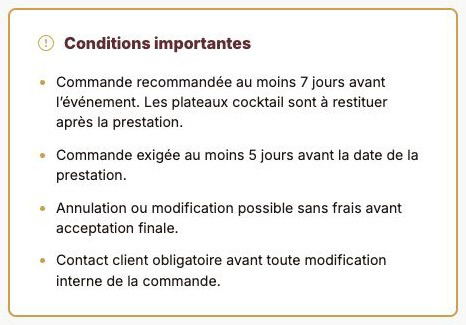
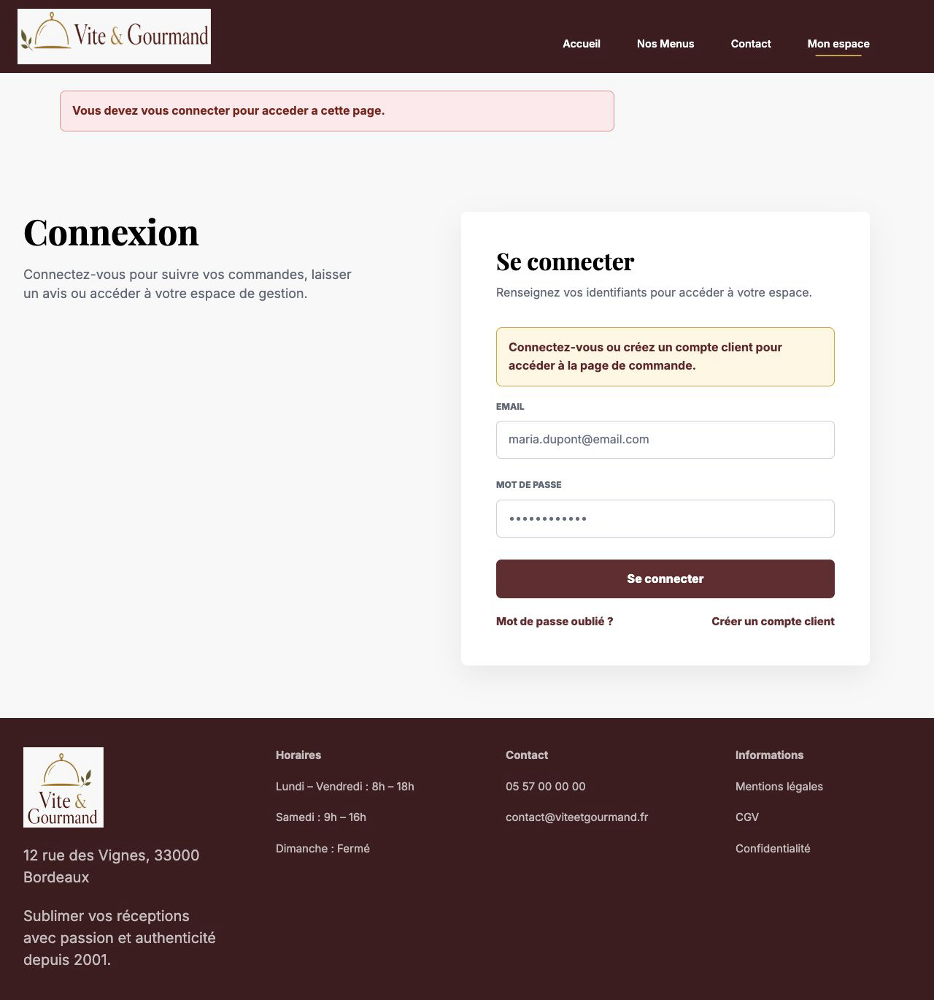
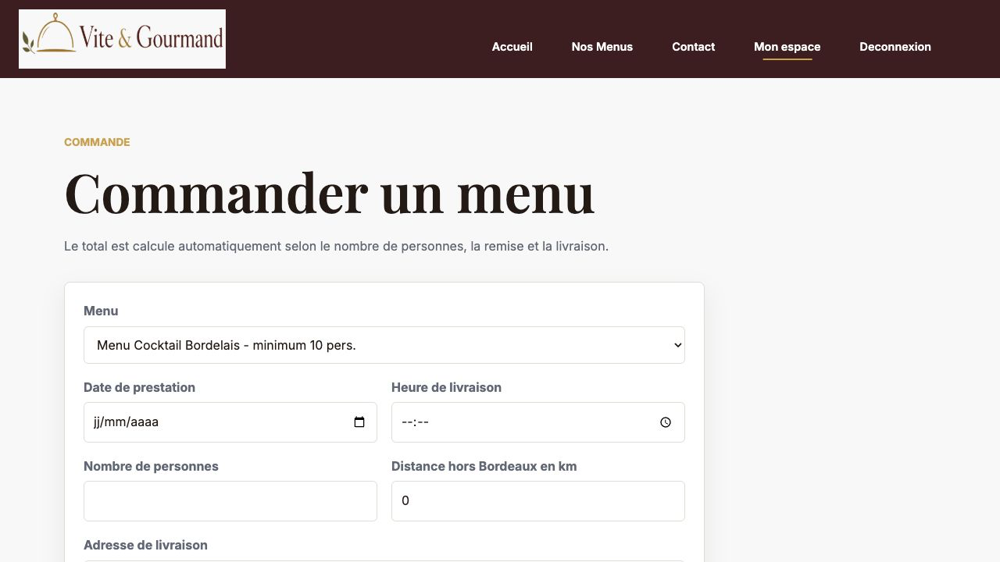

# Audit page 6 - Visiteur, commande et conditions de menu

Date : 22 juillet 2026.

Perimetre : page 6 de l'enonce ECF, application locale servie sur `127.0.0.1:8000` et captures navigateur sur `localhost:8000` pour isoler une session visiteur.

## Source enonce

Source locale : `docs/project-management/audit-page-06-assets/source-enonce-page-06.txt`.

Texte extrait :

> Si la personne est un visiteur (personne non authentifie) alors il lui sera demander de se connecter ou de concevoir un compte avant d'acceder a la page de commande.
>
> Attention : il doit etre mis bien en evidence les conditions de ce menu, afin d'eviter que le client puisse se plaindre qu'il n'a pas vu l'information.

## Verdict

La page 6 est **conforme apres correction**.

Les deux exigences obligatoires sont maintenant demontrees :

| Exigence page 6 | Statut | Preuves |
|---|---|---|
| Un visiteur ne peut pas acceder directement a la page de commande. | Valide | `GET /commandes/creation/6` retourne `302` vers `/connexion`. |
| Le visiteur peut se connecter ou creer un compte avant de reprendre la commande. | Valide | Page connexion avec lien creation compte, message contextuel, puis redirection post-authentification vers `/commandes/creation/6`. Test inscription : compte cree avec role `Customer`, redirection vers la commande, compte de test supprime. |
| Les conditions du menu sont mises en evidence. | Valide | Bloc visuel "Conditions importantes" avec bordure accentuee, condition metier du menu et conditions operationnelles. |

## Captures acceptees

### 1. Conditions visibles sur le detail menu



Preuve visuelle : le bloc met en avant la condition stockee pour le menu Cocktail Bordelais, notamment la restitution des plateaux, puis les conditions operationnelles.

### 2. Visiteur redirige vers connexion



Preuve visuelle : le visiteur voit le message d'erreur d'acces, le message de contexte "acceder a la page de commande" et le lien "Creer un compte client".

### 3. Commande reprise apres connexion



Preuve visuelle : apres connexion client, l'utilisateur arrive sur le formulaire de commande avec le menu Cocktail Bordelais preselectionne.

## Corrections appliquees

| Fichier | Correction | Raison |
|---|---|---|
| `app/Middlewares/AuthMiddleware.php` | Memorisation du chemin protege demande par un visiteur sur requete `GET`. | Permettre de reprendre la commande apres authentification. |
| `app/Controllers/AuthController.php` | Redirection post-login/post-inscription vers le chemin prevu si le chemin est local, autorise et compatible avec le role. | Eviter une redirection generique vers `/mon-compte` apres tentative de commande. |
| `app/Views/auth/login.php` | Message contextuel quand l'utilisateur arrive depuis une commande. | Rendre clair pourquoi la connexion est demandee. |
| `app/Views/auth/register.php` | Message contextuel et aide mot de passe alignee avec la regle serveur. | Rendre le parcours creation compte comprehensible. |
| `app/Views/auth/reset-password.php` | Libelle mot de passe passe a 10 caracteres minimum. | Correction de coherence auth heritee de l'audit page 5. |
| `app/Views/menus/show.php` | Fusion de la condition metier du menu avec les conditions importantes deja affichees. | La condition specifique du menu doit etre visible et opposable au client. |
| `public/assets/css/style.css` | Styles `.info-message` et `.form-help`. | Lisibilite des messages et aide formulaire. |

## Tests realises

### Qualite code

Resultats :

```text
composer check : OK
git diff --check : OK
```

### Parcours connexion depuis une commande

Scenario teste avec le compte client `claire.martin@example.test`.

```text
anonymous_status=302
anonymous_location=/connexion
login_notice=1
register_link=1
login_post_status=302
login_post_location=/commandes/creation/6
order_status=200
selected_menu_6=yes
```

Interpretation : le visiteur est bloque, la page de connexion explique le contexte, le lien creation de compte est visible, puis la connexion renvoie bien vers la commande du menu 6.

### Parcours inscription depuis une commande

Scenario teste avec un email temporaire `audit-page6-1784682045@example.test`, supprime apres test.

```text
created_role=Customer
cleanup=deleted
anonymous_status=302
anonymous_location=/connexion
register_notice=1
register_post_status=302
register_post_location=/commandes/creation/6
```

Interpretation : la creation publique attribue bien le role client, revient vers la commande demandee, et ne laisse pas de donnee de test durable.

### Conditions du menu

Controle HTTP du detail menu 6 :

```text
Conditions importantes : present
Commande recommandee au moins 7 jours : present
Plateaux cocktail a restituer : present
Commande exigee au moins 5 jours : present
Annulation ou modification : present
```

Controle base de donnees :

```text
menu_id=6
condition_length=121
condition_sample=Commande recommandee au moins 7 jours avant l'evenement. Les plateaux cocktail sont a restituer apres la prestation.
```

## Securite et architecture

Points valides :

- La redirection prevue est stockee uniquement pour les requetes `GET`.
- Le chemin prevu doit etre local et ne peut pas commencer par `//`, ce qui evite une redirection externe simple.
- Le chemin prevu est consomme une seule fois apres authentification.
- Un allowlist par role evite de renvoyer un role vers une zone non prevue.
- Les formulaires login/inscription restent proteges par CSRF.

Point a surveiller plus tard :

- Le formulaire de commande garde le champ "Nombre de personnes" vide apres preselection du menu. Ce n'est pas une exigence page 6, car le serveur valide le minimum, mais ce sera a recontroler avec la page consacree au parcours commande.

## Decision push/main

Decision : **pret a etre pousse pour le perimetre page 6**, sous reserve de garder les captures et ce rapport avec le commit.

La correction est limitee, testee localement, et ameliore directement la conformite avec l'enonce.
