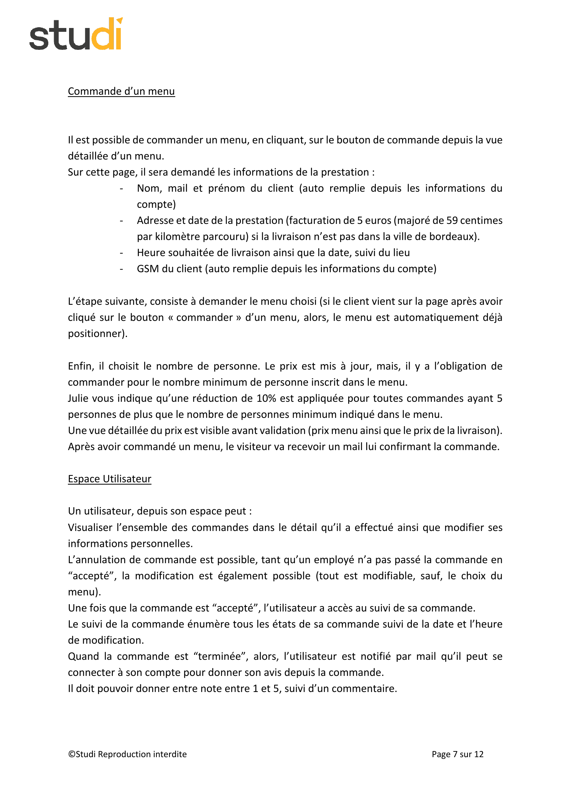
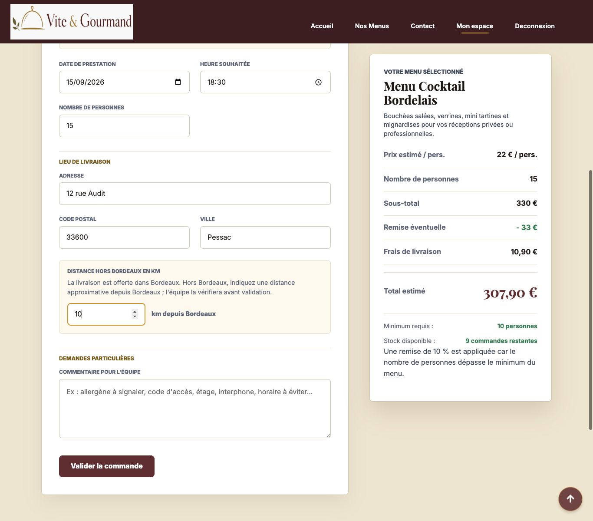
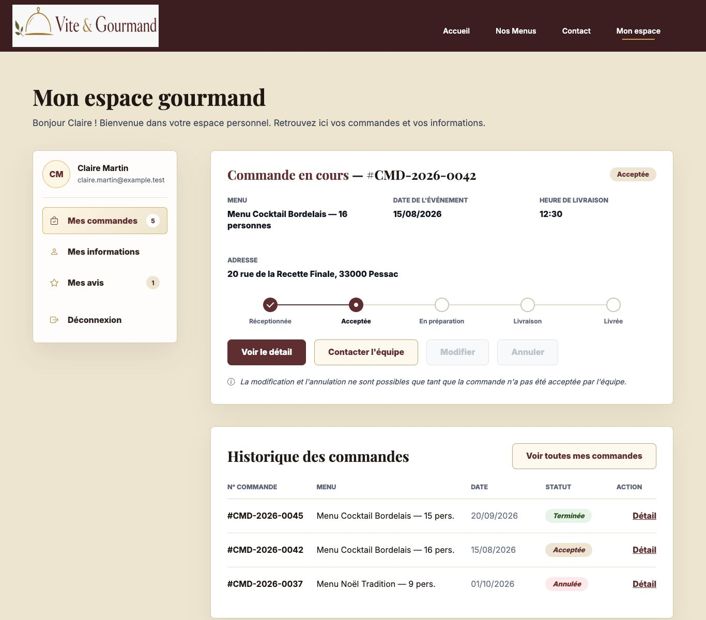
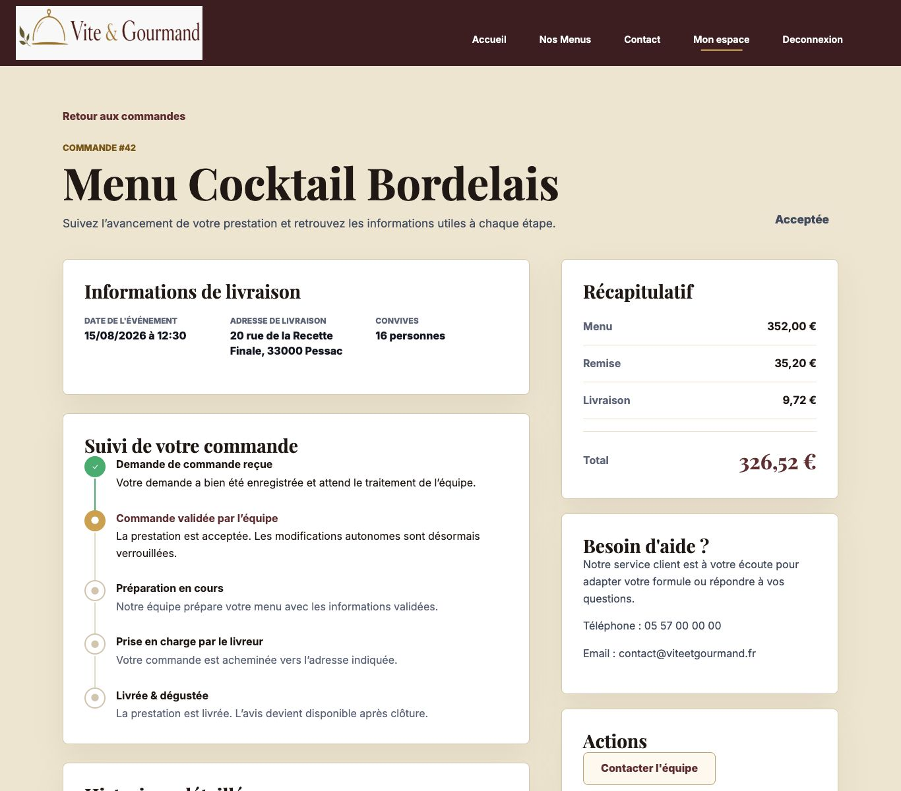
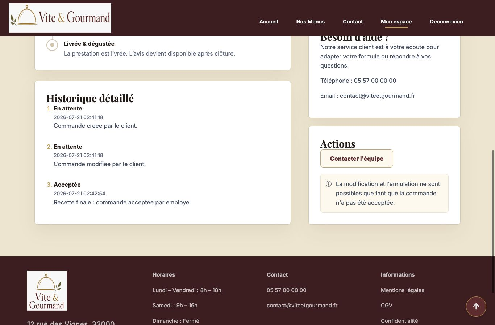
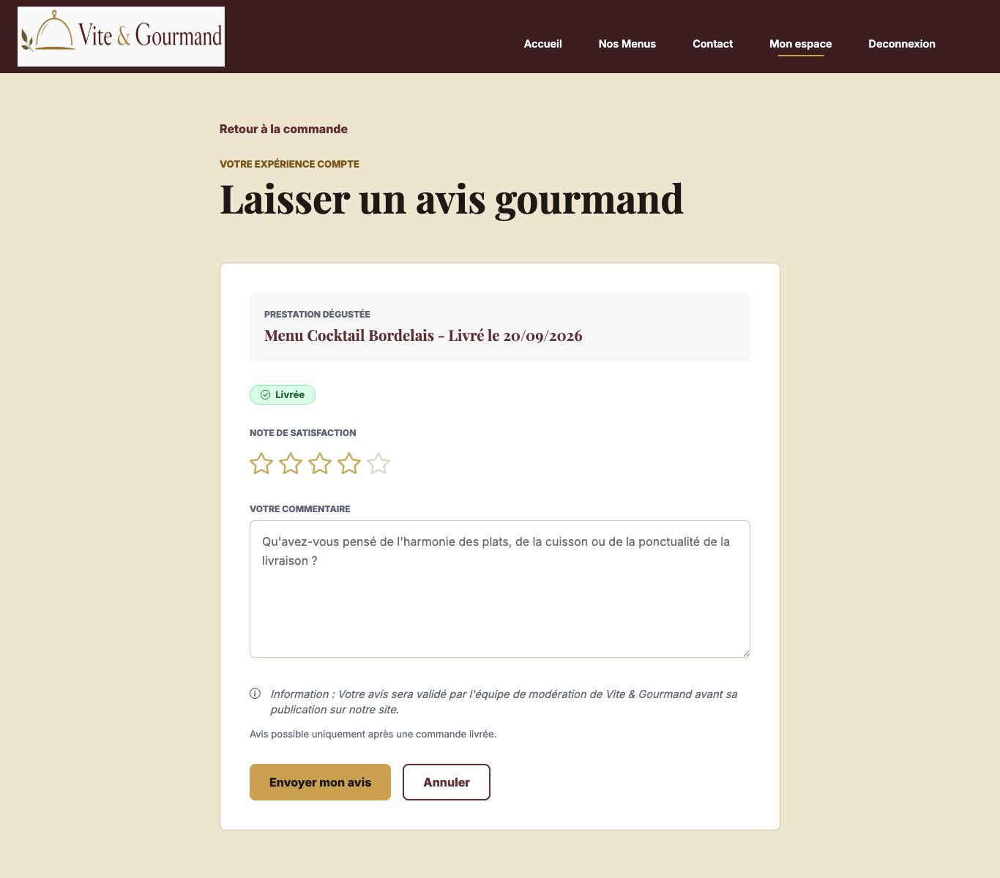
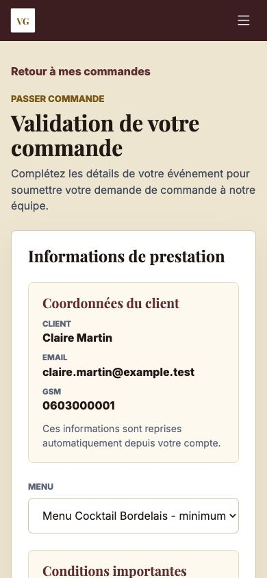

# Audit page 7 - Commande et espace client

Date de controle : 22 juillet 2026.

## Perimetre

Page 7 de l'enonce : commande d'un menu, calcul de prix, confirmation email,
espace utilisateur, modification/annulation avant acceptation, suivi de commande
et avis apres commande terminee.

Sources controlees :

- Enonce : `Enonce.pdf`, page 7, extrait dans `audit-page-07-assets/source-enonce-page-07.txt`.
- Code local non pousse : `OrderController`, `OrderModel`, `ReviewController`,
  `ReviewModel`, vues `orders/*`, vues `account/*`, vues `reviews/*`,
  `public/assets/js/app.js`, `public/assets/css/style.css`.
- Documentation locale : `README.md`, `docs/design.md`,
  `docs/project-management/client-connected-user-stories-validation.md`,
  `docs/manual/mvp-test-checklist.md`.
- Figma/documentation locale : lien global et fichier `.fig` references dans
  `../Maquettes/README.md`, frames client/avis referencees dans `docs/design.md`.
- Base SQL locale : `commandes`, `commande_statuts`, `avis`, `utilisateurs`,
  `menus`.

## Captures

Enonce page 7 :

Formulaire commande avec prix dynamique :

Espace client avec commandes, informations et avis :

Detail commande acceptee avec suivi et recapitulatif :

Historique detaille avec dates/heures :

Formulaire d'avis apres commande terminee :

Responsive mobile du bloc coordonnees client :

## Corrections realisees avant verdict

| Point | Correction |
|---|---|
| Coordonnees client auto-remplies peu visibles | Ajout d'un bloc `Coordonnees du client` dans creation et modification de commande. |
| Email de confirmation commande absent | Ajout de `MailService` et appel apres creation de commande. |
| Email d'invitation avis absent | Envoi au client quand l'employe passe la commande en `terminee`. |
| Donnees client necessaires aux emails employe | Ajout de `OrderModel::findOneForEmployee()`. |
| Responsive du nouveau bloc client | Passage du bloc coordonnees en une colonne sur mobile. |

## Matrice des exigences page 7

| Exigence enonce | Verification | Statut |
|---|---|---|
| Commander depuis le bouton d'une fiche menu | Route `/commandes/creation/{menuId}` presente ; le bouton detail menu pointe vers cette route. Test `GET /commandes/creation/6` en 200. | Conforme |
| Nom, prenom, email et GSM auto-remplis depuis le compte | `OrderController::create/edit` charge `UserModel::findById()`. Capture mobile : Claire Martin, email et GSM visibles. | Conforme apres correction |
| Adresse, date, heure et lieu de livraison demandes | Champs `date_prestation`, `heure_livraison`, `adresse_livraison`, `code_postal_livraison`, `ville_livraison` presents et valides serveur. | Conforme |
| Livraison 5 EUR + 0,59/km hors Bordeaux | `OrderModel::calculateTotals()` et l'apercu JS appliquent la regle ; test Pessac 10 km = 10,90 EUR. | Conforme |
| Menu preselectionne apres clic "commander" | Test `/commandes/creation/6` : Menu Cocktail Bordelais selectionne. | Conforme |
| Nombre de personnes avec minimum obligatoire | POST avec 9 personnes pour menu minimum 10 retourne erreur serveur. | Conforme |
| Prix mis a jour et vue detaillee avant validation | Capture desktop : prix/pers., personnes, sous-total, remise, livraison, total. | Conforme |
| Remise 10 % si minimum + 5 personnes | Test menu 6, 15 personnes : menu 330,00 EUR, remise 33,00 EUR, livraison 10,90 EUR, total 307,90 EUR. | Conforme |
| Email de confirmation apres commande | Test commande temporaire #44 : `SUBJECT: Confirmation de votre commande Vite & Gourmand` dans `storage/logs/mail.log`. | Conforme apres correction |
| Espace utilisateur : commandes en detail et informations personnelles | `/mon-compte`, `/commandes`, `/commandes/{id}`, `/mon-compte/profil` disponibles ; capture espace client. | Conforme |
| Annulation/modification possible avant acceptation | Test commande #44 : edition 200 en `en_attente`, puis redirection apres passage `acceptee`. Test #46 : annulation client en `en_attente` avec motif et historique. | Conforme |
| Tout modifiable sauf le menu | `updatePendingForUser()` met a jour prestation, adresse, personnes, prix, commentaire, mais jamais `id_menu`. | Conforme |
| Suivi apres commande acceptee | Commande #42 `acceptee` visible avec timeline et actions verrouillees. | Conforme |
| Etats historises avec date/heure | Capture historique detaille : lignes `En attente` et `Acceptee` horodatees. | Conforme |
| Email quand commande terminee pour laisser un avis | Test #44 : `SUBJECT: Votre avis nous interesse` dans `storage/logs/mail.log`. | Conforme apres correction |
| Avis note 1 a 5 + commentaire | GET `/avis/creation/{id}` en 200, POST note 6 refuse, POST note 5 cree un avis `en_attente`. | Conforme |

## Tests rejoues

Tests du 22 juillet 2026 :

| Test | Resultat |
|---|---|
| `composer check` | OK : composer valide et syntaxe PHP OK. |
| Acces `/commandes` deconnecte | 302 vers connexion. |
| Connexion Claire | 302 vers espace client/route demandee. |
| `GET /commandes/creation/6` | 200, menu selectionne, coordonnees client visibles. |
| POST commande sous minimum | 200 avec erreur "minimum du menu". |
| POST commande valide temporaire #44 | 302 vers `/commandes/44`. |
| Controle SQL commande #44 | `prix_menu=330.00`, `remise=33.00`, `prix_livraison=10.90`, `prix_total=307.90`, `statut_actuel=en_attente`. |
| Historique initial #44 | Ligne `en_attente` creee dans `commande_statuts`. |
| Detail commande #44 | 200, total `307,90`, historique et actions visibles. |
| Edition #44 avant acceptation | 200. |
| Annulation client temporaire #46 | 302 vers detail, statut `annulee`, motif et ligne d'historique crees. |
| Passage #44 en `acceptee` par Lucas | 302, statut mis a jour. |
| Edition #44 apres acceptation | 302 vers detail, modification verrouillee. |
| Passage #44 en `terminee` | 302, email avis journalise. |
| GET avis #44 | 200, formulaire note/commentaire visible. |
| POST avis note 6 | 200 avec erreur "comprise entre 1 et 5". |
| POST avis note 5 | 302 vers `/avis`, avis cree en `en_attente`. |
| Nettoyage donnees temporaires | Commandes #44/#45/#46, statuts et avis temporaires supprimes. |

## Notes UX, accessibilite et documentation

Points solides :

- Le parcours client est coherent : choix menu, commande, suivi, avis.
- Le recapitulatif prix est visible avant validation et reste synchronise avec
  la source serveur.
- Les actions sensibles sont expliquees quand elles sont verrouillees.
- Le formulaire d'avis reste conditionne par une commande terminee sans avis.
- Le nouveau bloc coordonnees reste lisible sur mobile.

Risques ou limites a expliquer au jury :

- En local, les emails peuvent rester journalises dans `storage/logs/mail.log`
  avec `MAIL_MAILER=log`, ou etre envoyes dans une inbox Mailpit avec
  `MAIL_MAILER=smtp`. En production, il faudra brancher un SMTP reel.
- La distance hors Bordeaux est saisie manuellement. C'est documente via
  `DELIVERY_DISTANCE_PROVIDER=manual` et explique dans l'interface ; une API de
  geocodage serait une evolution hors MVP.
- Les captures prouvent le rendu visible, mais ne suffisent pas a garantir une
  conformite WCAG complete. Les labels, statuts et erreurs principales sont
  presents, mais un audit lecteur d'ecran complet resterait a part.
- La documentation Figma locale signale encore des points globaux a nettoyer
  avant rendu final : nomenclature des frames, harmonisation narrative et
  statuts de commande.

## Verdict

La page 7 de l'enonce est conforme apres corrections. Les livrables
fonctionnels obligatoires sont operationnels, testes localement, documentes dans
ce rapport, et le code de ce perimetre est pret a etre pousse sur `main`, sous
reserve de presenter soit l'inbox Mailpit, soit l'explication du fallback
`MAIL_MAILER=log` pour la demonstration locale.
